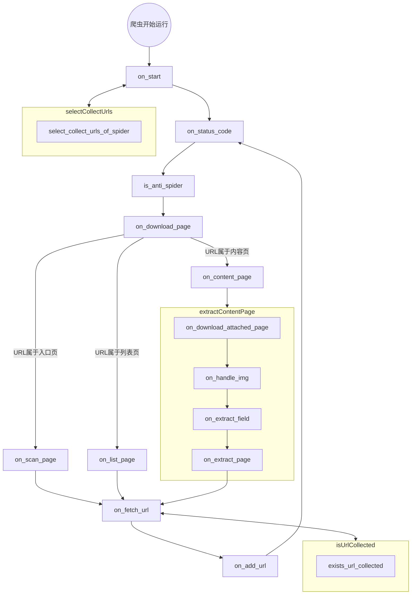

# PhpSpider



```txt
on_extract_page End[结束] -->

on_start --> selectCollectUrlsOfSpider --> add_url --> on_start
```

## 表结构设计

### `table::phpspider_contents`

| Name         | Type | Nullable | Index | Default | Comment |
| ------------ | ---- | -------- | ----- | ------- | ------- |
| id           |      |          |       |         |         |
| slug         |      |          |       |         |         |
| name         |      |          |       |         |         |
| max_depth    |      |          |       |         |         |
| max_fields   |      |          |       |         |         |
| domains      |      |          |       |         |         |
| export_table |      |          |       |         |         |
|              |      |          |       |         |         |
|              |      |          |       |         |         |

### `table::phpspider_fields`

| Name | Type | Nullable | Index | Default | Comment |
| ---- | ---- | -------- | ----- | ------- | ------- |
|      |      |          |       |         |         |
|      |      |          |       |         |         |

### `table::phpspider_logs`

| Name | Type | Nullable | Index | Default | Comment |
| ---- | ---- | -------- | ----- | ------- | ------- |
|      |      |          |       |         |         |
|      |      |          |       |         |         |

### `table::phpspider_collect_urls`

| Name       | Type | Nullable | Index | Default | Comment |
| ---------- | ---- | -------- | ----- | ------- | ------- |
| content_id |      |          |       |         |         |
| name       |      |          |       |         |         |
| selector   |      |          |       |         |         |
|            |      |          |       |         |         |
|            |      |          |       |         |         |
