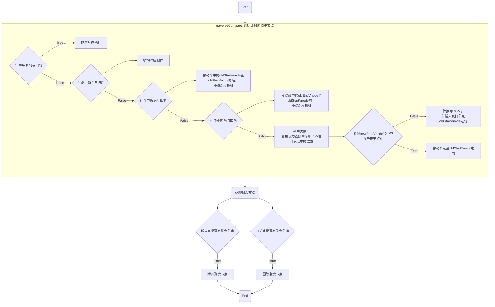
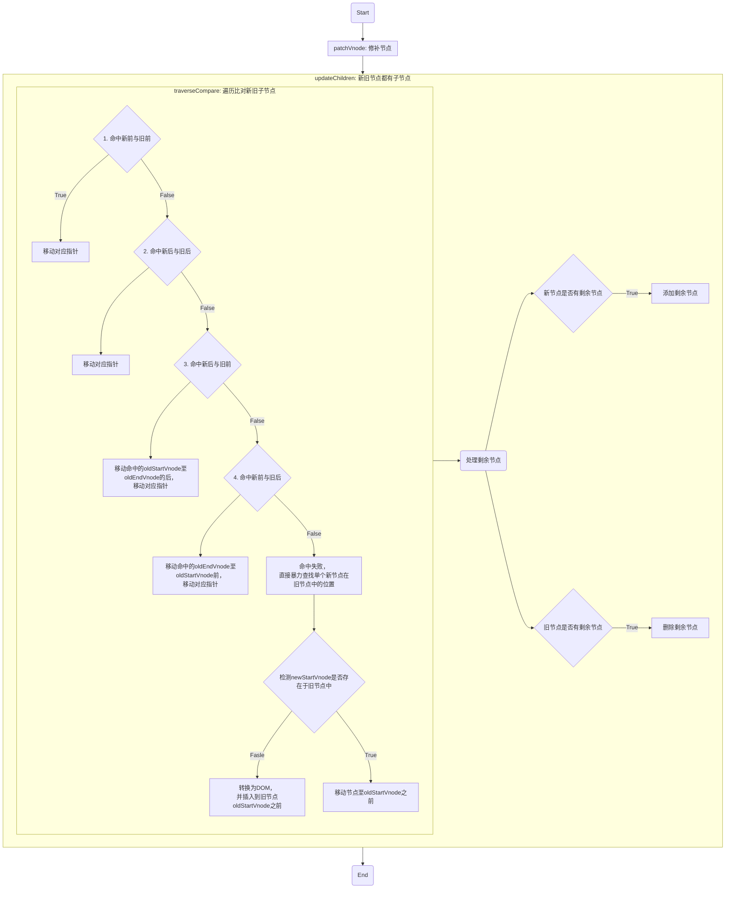

# SimpleSnabbdom

[snabbdom](https://github.com/snabbdom/snabbdom)| [simple-snabbdom](https://github.com/langnang/simple-snabbdom)

## vnode

## h

## patch

## patchVnode

## updateChildren

> 新旧节点都有子节点的情况下，diff 更新新旧子节点

**语法**

```js
updateChildren(newChildren, oldChildren, parent);
```




