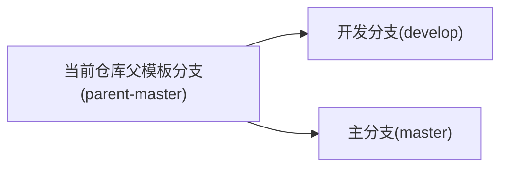

# Merge Branch

合并分支

## merge-branch

- [Merge branch](https://github.com/marketplace/actions/merge-branch): Runs a git merge in your CI.

```yml
# Merge the parent template to the current template

name: Merge Template to Current
on:
  push:
    branches:
      - "parent-master"

jobs:
  sync-master-branch:
    runs-on: ubuntu-latest
    steps:
      - uses: actions/checkout@master

      - name: Merge parent -> master
        uses: devmasx/merge-branch@master
        with:
          from_branch: "parent-master"
          target_branch: "master"
          github_token: ${{ github.GITHUB_TOKEN }}

  sync-develop-branch:
    runs-on: ubuntu-latest
    steps:
      - uses: actions/checkout@master

      - name: Merge parent -> develop
        uses: devmasx/merge-branch@master
        with:
          from_branch: "parent-master"
          target_branch: "develop"
          github_token: ${{ github.GITHUB_TOKEN }}
```


